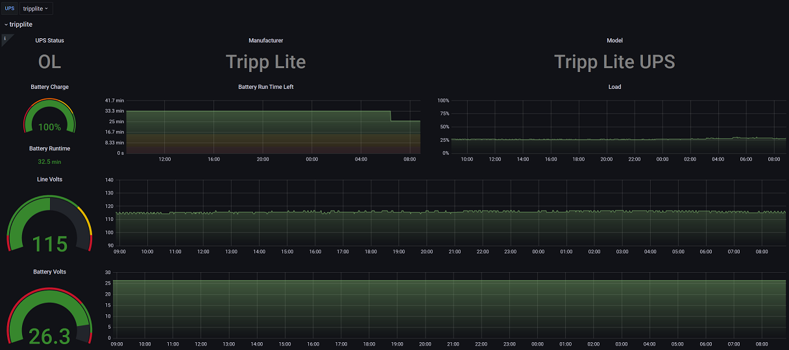

# Network UPS Tools (NUT) Prometheus Exporter

A [Prometheus](https://prometheus.io) exporter for the Network UPS Tools server. This exporter utilizes the [go.nut](https://github.com/robbiet480/go.nut) project as a network client of the NUT platform. The exporter is written in a way to permit an administrator to scrape one or many UPS devices visible to a NUT client as well as one or all NUT variables. A single instance of this exporter can scrape one or many NUT servers as well.

A sample [dashboard](dashboard/dashboard.json) for Grafana is also available


## Variables and information
The variables exposed to a NUT client by the NUT system are the lifeblood of a deployment. These variables are consumed by this exporter and coaxed to Prometheus types.

 * See the [NUT documentation](https://networkupstools.org/docs/user-manual.chunked/apcs01.html) for a list of all possible variables
 * Variables are set as prometheus metrics with the `ups` name added as a lable. Example: `ups.load` is set as `network_ups_tools_ups_load 100`
 * The exporter SHOULD be called with the ups to scrape set in the query string. Example: `https://127.0.0.1:9199/ups_metrics?ups=foo`
 * If the exporter scrapes NUT and detects more than one UPS, it is an error condition that will fail the scrape. In this case, use a variant of the scrape config example below for your environment
 * Default configs usually permit reading variables without authentication. If you have disabled this, see the Usage below to set credentials
 * This exporter will always export the device.* metrics as labels, except for uptime, with a constant value of 1
 * Setting the `nut.vars_enable` parameter to an empty string will cause all numeric variables to be exported
 * NUT may return strings as values for some variables. Prometheus supports only float values, so the `on_regex` and `off_regex` parameters can be used to convert these to 0 or 1 in some cases
 * Not all driver and UPS implementations provide all variables. Run this exporter with log.level at debug or use the `LIST VAR` upsc command to see available variables for your UPS
 * All number-like values are coaxed to the appropriate go type by the library and are set as the value of the exported metric
 * Boolean values are coaxed to 0 (false) or 1 (true)

### ups.status handling
The special `ups.status` variable is returned by NUT as a string containing a list of status flags.
There may be one or more flags set depending on the driver in use and the current state of the UPS.
For example, `OL TRIM CHRG` indicates the UPS is online, stepping down incoming voltage and charging the battery.

The metric `network_ups_tools_ups_status` will be set with a label for each flag returned with a constant value of `1`

**Example**
The above example will coax `OL TRIM CHRG` to...
```
network_ups_tools_ups_status{flag="OL"} 1
network_ups_tools_ups_status{flag="TRIM"} 1
network_ups_tools_ups_status{flag="CHRG"} 1
```

The exporter supports the `--nut.statuses` flag to allow you to force certain statuses to be exported at all times, regardless of whether NUT reports the status.
This defaults to the below known list of statuses.

**Example**
Without changing the defaults, the status of `OL TRIM CHRG` will cause the following labels and values to be exported:
```
network_ups_tools_ups_status{flag="OL"} 1
network_ups_tools_ups_status{flag="TRIM"} 1
network_ups_tools_ups_status{flag="CHRG"} 1
network_ups_tools_ups_status{flag="OB"} 0
network_ups_tools_ups_status{flag="LB"} 0
network_ups_tools_ups_status{flag="HB"} 0
network_ups_tools_ups_status{flag="RB"} 0
network_ups_tools_ups_status{flag="DISCHRG"} 0
network_ups_tools_ups_status{flag="BYPASS"} 0
network_ups_tools_ups_status{flag="CAL"} 0
network_ups_tools_ups_status{flag="OFF"} 0
network_ups_tools_ups_status{flag="OVER"} 0
network_ups_tools_ups_status{flag="BOOST"} 0
network_ups_tools_ups_status{flag="FSD"} 0
network_ups_tools_ups_status{flag="FD"} 0
```
Because each UPS differs, it is advisable to observe your UPS under various conditions to know which of these statuses will never apply.


#### Alerting on ups.status
**IMPORTANT NOTE:** Not all UPSs utilize all values! What is reported by NUT depends greatly on the driver and the intelligence of the UPS.
It is strongly suggested to observe your UPS under both "normal" and "abnormal" conditions to know what to expect NUT will report.

As noted above, the UPS status is a special case and is handled with flags set as labels on the `network_ups_tools_ups_status` metric. Therefore, alerting can be configured for specific statuses. Examples:
 * **Alert if the UPS has exited 'online' mode**: `network_ups_tools_ups_status{flag="OL"} == 0`
 * **Alert if the UPS has gone on battery**:  `network_ups_tools_ups_status{flag="OB"} == 1`
 * **Alert if any status changed in the past 5 minutes** changes(network_ups_tools_ups_status[5m])

Unfortunately, the NUT documentation does not call out the full list of statuses each driver implements nor what a user can expect for a status.
The following values were detected in the [NUT driver documentation](https://github.com/networkupstools/nut/blob/master/docs/new-drivers.txt):
 * OL - On line (mains is present)
 * OB - On battery (mains is not present)
 * LB - Low battery
 * HB - High battery
 * RB - The battery needs to be replaced
 * CHRG - The battery is charging
 * DISCHRG - The battery is discharging (inverter is providing load power)
 * BYPASS - UPS bypass circuit is active -- no battery protection is available
 * CAL - UPS is currently performing runtime calibration (on battery)
 * OFF - UPS is offline and is not supplying power to the load
 * OVER - UPS is overloaded
 * TRIM - UPS is trimming incoming voltage (called "buck" in some hardware)
 * BOOST - UPS is boosting incoming voltage
 * FSD and SD - Forced Shutdown
Therefore, these are all enabled in the default value for `--nut.statuses`. 

### Query String Parameters
The exporter allows for per-scrape overrides of command line parameters by passing query string parameters. This enables a single nut_exporter to scrape multiple NUT servers

The following query string parameters can be passed to the `/ups_metrics` path:
  * `ups` - Required if more than one UPS is present in NUT)
  * `server` - Overrides the command line parameter `--nut.server`
  * `username` - Overrides the command line parameter `--nut.username`
  * `password` - Overrides the environment variable NUT_EXPORTER_PASSWORD. It is **strongly** recommended to avoid passing credentials over http unless the exporter is configured with TLS
  * `variables` - Overrides the command line parameter `--nut.vars_enable`
  * `statuses` - Overrides the command line parameter `--nut.statuses`
See the example scrape configurations below for how to utilize this capability

### Example Prometheus Scrape Configurations
Note that this exporter will scrape only one UPS per scrape invocation. If there are multiple UPS devices visible to NUT, you MUST ensure that you set up different scrape configs for each UPS device. Here is an example configuration for such a use case:

```
  - job_name: nut-primary
    metrics_path: /ups_metrics
    static_configs:
      - targets: ['myserver:9199']
        labels:
          ups:  "primary"
    params:
      ups: [ "primary" ]
  - job_name: nut-secondary
    metrics_path: /ups_metrics
    static_configs:
      - targets: ['myserver:9199']
        labels:
          ups:  "secondary"
    params:
      ups: [ "secondary" ]
```

You can also configure a single exporter to scrape several NUT servers like so:
```
  - job_name: nut-primary
    metrics_path: /ups_metrics
    static_configs:
      - targets: ['exporterserver:9199']
        labels:
          ups:  "primary"
    params:
      ups: [ "primary" ]
      server: [ "nutserver1" ]
  - job_name: nut-secondary
    metrics_path: /ups_metrics
    static_configs:
      - targets: ['exporterserver:9199']
        labels:
          ups:  "secondary"
    params:
      ups: [ "secondary" ]
      server: [ "nutserver2" ]
```

Or use a more robust relabel config similar to the [snmp_exporter](https://github.com/prometheus/snmp_exporter) (thanks to @sshaikh for the example):
```
  - job_name: ups
    static_configs:
      - targets: ['server1','server2'] # nut exporter
    metrics_path: /ups_metrics
    relabel_configs:
      - source_labels: [__address__]
        target_label: __param_server
      - source_labels: [__param_server]
        target_label: instance
      - target_label: __address__
        replacement: nut-exporter.local:9199
```

&nbsp;

## Installation

### Binaries

Download the already existing [binaries](https://github.com/DRuggeri/nut_exporter/releases) for your platform:

```bash
$ ./nut_exporter <flags>
```

### From source

Using the standard `go install` (you must have [Go](https://golang.org/) already installed in your local machine):

```bash
$ go install github.com/DRuggeri/nut_exporter
$ nut_exporter <flags>
```

### With Docker
An official scratch-based Docker image is built with every tag and pushed to DockerHub and ghcr. Additionally, PRs will be tested by GitHubs actions.

The following images are available for use:
- [druggeri/nut_exporter](https://hub.docker.com/r/druggeri/nut_exporter)
- [ghcr.io/DRuggeri/nut_exporter](https://ghcr.io/DRuggeri/nut_exporter)

&nbsp;

## Usage

### Flags

```
usage: nut_exporter [<flags>]


Flags:
  -h, --[no-]help                Show context-sensitive help (also try --help-long and --help-man).
      --nut.server="127.0.0.1"   Hostname or IP address of the server to connect to. ($NUT_EXPORTER_SERVER) ($NUT_EXPORTER_SERVER)
      --nut.serverport=3493      Port on the NUT server to connect to. ($NUT_EXPORTER_SERVER) ($NUT_EXPORTER_SERVERPORT)
      --nut.username=NUT.USERNAME  
                                 If set, will authenticate with this username to the server. Password must be set in NUT_EXPORTER_PASSWORD environment variable. ($NUT_EXPORTER_USERNAME)
                                 ($NUT_EXPORTER_USERNAME)
      --[no-]nut.disable_device_info  
                                 A flag to disable the generation of the device_info meta metric. ($NUT_EXPORTER_DISABLE_DEVICE_INFO) ($NUT_EXPORTER_DISABLE_DEVICE_INFO)
      --nut.vars_enable="battery.charge,battery.voltage,battery.voltage.nominal,input.voltage,input.voltage.nominal,ups.load,ups.status"  
                                 A comma-separated list of variable names to monitor. See the variable notes in README. ($NUT_EXPORTER_VARIABLES) ($NUT_EXPORTER_VARIABLES)
      --nut.on_regex="^(enable|enabled|on|true|active|activated)$"  
                                 This regular expression will be used to determine if the var's value should be coaxed to 1 if it is a string. Match is case-insensitive. ($NUT_EXPORTER_ON_REGEX)
                                 ($NUT_EXPORTER_ON_REGEX)
      --nut.off_regex="^(disable|disabled|off|false|inactive|deactivated)$"  
                                 This regular expression will be used to determine if the var's value should be coaxed to 0 if it is a string. Match is case-insensitive. ($NUT_EXPORTER_OFF_REGEX)
                                 ($NUT_EXPORTER_OFF_REGEX)
      --nut.statuses="OL,OB,LB,HB,RB,CHRG,DISCHRG,BYPASS,CAL,OFF,OVER,TRIM,BOOST,FSD,SD"  
                                 A comma-separated list of statuses labels that will always be set by the exporter. If NUT does not set these flags, the exporter will force the
                                 network_ups_tools_ups_status{flag="NAME"} to 0. See the ups.status notes in README.' ($NUT_EXPORTER_STATUSES) ($NUT_EXPORTER_STATUSES)
      --metrics.namespace="network_ups_tools"  
                                 Metrics Namespace ($NUT_EXPORTER_METRICS_NAMESPACE) ($NUT_EXPORTER_METRICS_NAMESPACE)
      --[no-]web.systemd-socket  Use systemd socket activation listeners instead of port listeners (Linux only).
      --web.listen-address=:9199 ...  
                                 Addresses on which to expose metrics and web interface. Repeatable for multiple addresses.
      --web.config.file=""       [EXPERIMENTAL] Path to configuration file that can enable TLS or authentication. See:
                                 https://github.com/prometheus/exporter-toolkit/blob/master/docs/web-configuration.md
      --web.telemetry-path="/ups_metrics"  
                                 Path under which to expose the UPS Prometheus metrics ($NUT_EXPORTER_WEB_TELEMETRY_PATH) ($NUT_EXPORTER_WEB_TELEMETRY_PATH)
      --web.exporter-telemetry-path="/metrics"  
                                 Path under which to expose process metrics about this exporter ($NUT_EXPORTER_WEB_EXPORTER_TELEMETRY_PATH) ($NUT_EXPORTER_WEB_EXPORTER_TELEMETRY_PATH)
      --[no-]printMetrics        Print the metrics this exporter exposes and exits. Default: false ($NUT_EXPORTER_PRINT_METRICS) ($NUT_EXPORTER_PRINT_METRICS)
      --log.level=info           Only log messages with the given severity or above. One of: [debug, info, warn, error]
      --log.format=logfmt        Output format of log messages. One of: [logfmt, json]
      --[no-]version             Show application version.
```

&nbsp;

## TLS and basic authentication

The NUT Exporter supports TLS and basic authentication.

To use TLS and/or basic authentication, you need to pass a configuration file
using the `--web.config.file` parameter. The format of the file is described
[in the exporter-toolkit repository](https://github.com/prometheus/exporter-toolkit/blob/master/docs/web-configuration.md).

## Metrics

### NUT
This collector is the workhorse of the exporter. Default metrics are exported for the device and scrape stats. The `network_ups_tools_ups_variable` metric is exported with labels of `ups` and `variable` with the value set as noted in the README

```
  network_ups_tools_device_info - UPS device information
  network_ups_tools_VARIABLE_NAME - Variable from Network UPS Tools as noted in the variable notes above
```
